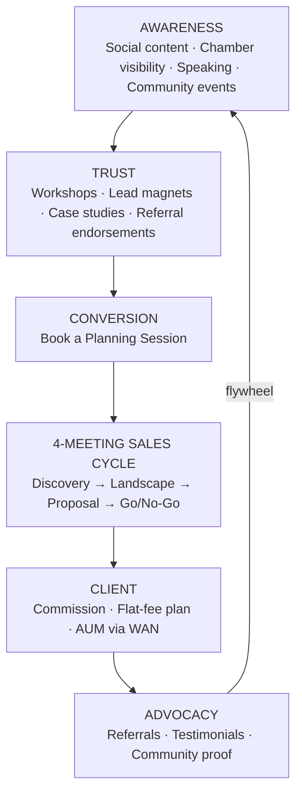
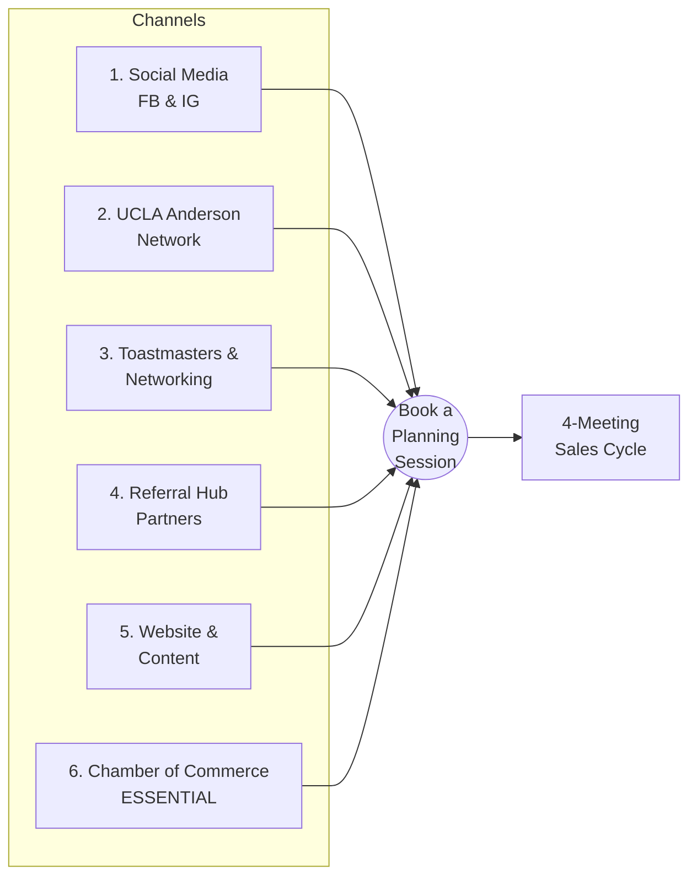
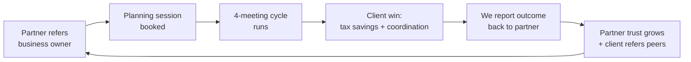
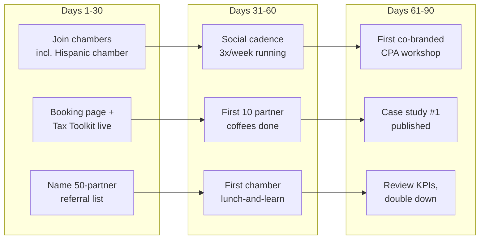

# Pinnacle Planning — Marketing Plan
**Make the right business owner feel seen — and create a natural path to a planning session.**
*Prepared: August 2, 2026 | Companion to WAN-Ops-2026-08-01 (Sales Operations Playbook) and the Client Presentation deck*

---

## 1. Executive Summary

Pinnacle Planning's marketing has one job: make the ideal business owner think **"these people help people like me"** — and then book a planning session. Everything in this plan funnels toward that single conversion event, because once a prospect enters the **4-meeting sales cycle**, the Sales Operations Playbook takes over.

**The strategy in one paragraph:** Lead with tax pain (the universal business-owner frustration), earn trust through education and community presence (Chamber of Commerce is the essential channel), build a referral hub of CPAs, attorneys, and bankers who see the pain first, and cultivate the Hispanic business community as our emerging market. Every channel drives to one destination: a booked Discovery meeting.

**Top priorities:**
1. Chamber of Commerce presence — essential, immediate
2. Referral hub activation — CPAs first (they see the tax pain every April)
3. Tax-pain content engine on Facebook & Instagram
4. Hispanic emerging-market entry via Hispanic chambers and community associations
5. Website & lead magnets as the credibility anchor behind every channel

---

## 2. Positioning & Core Message

### Who we are (positioning statement)
> For business owners with $500K+ in revenue who are paying too much tax and flying blind despite making good money, Pinnacle Planning is the advanced planning division that quarterbacks your entire financial team — CPA, attorney, insurance, retirement — under a coordinated, fiduciary-minded plan. Unlike product-first agents or file-and-forget CPAs, we look at the whole picture, and we prove it in four structured meetings.

### The primary hook: taxes
> **"You built something. You're paying a significant tax bill every April. There are legal strategies most business owners never hear about that could shelter $100K to $300K of your income this year and turn your tax burden into your retirement plan. That conversation starts here."**

### Secondary messaging (after the tax door opens)
Insurance gaps · no coordinated plan · wealth trapped in the business · no succession strategy · no trusted advisor · flying blind despite making good money · children's college and financial legacy.

**Message discipline:** the tax pain gets them in the door; the full planning experience (Quarterback Model, Wealth Navigator, Right Capital) keeps them.

---

## 3. Target Markets

### Core market
Business owners and entrepreneurs: **$500K+ business revenue, $250K–$1M+ personal income, age 40–60**, 1–10 employees, coachable, time-poor, no advisor they fully trust. (Full profile in the Sales Ops Playbook qualification filter.)

### Emerging market: the Hispanic business community
One of the fastest-growing segments of U.S. business ownership and broadly underserved by advanced planning. Values alignment is strong — family, legacy, multi-generational wealth. Entry channels: Hispanic chambers of commerce, community business associations, Spanish-language business events. Same tax-pain hook, delivered with cultural fluency; bilingual materials developed over time. (Detailed plan in Section 8.)

---

## 4. The Marketing Funnel

Every channel feeds one funnel, and the funnel ends where the Sales Ops Playbook begins.

**Design principles:**
- Every asset has exactly one call to action: **book a planning session.**
- No channel is expected to close business — channels create warm, qualified conversations; the 4-meeting cycle closes.
- A well-closed "no-go" stays in the flywheel (6-month check-ins, referral potential).

---

## 5. Channel Strategy (Six Channels)

### Channel 6 — Chamber of Commerce (ESSENTIAL — lead channel)
This is where the ideal client already congregates, and where referral partners (CPAs, attorneys, bankers) are also members.

| Element | Plan |
|---|---|
| Presence | Join 1–2 local chambers + 1 Hispanic chamber; attend every mixer and expo for the first 90 days |
| Authority | Secure a committee or ambassador role within 6 months; target a board-adjacent role in year 2 |
| Education | Quarterly "Business Owner Tax Strategy" lunch-and-learn; offer as free chamber member benefit |
| Sponsorship | Sponsor 2–3 flagship events per year (visibility in front of qualified owners) |
| Conversion | Every talk and table ends with the same CTA: book a planning session; bring the Tax Essentials Toolkit as the takeaway |
| KPI | 4+ chamber-sourced planning sessions per quarter by Q2 2027 |

### Channel 4 — Referral Hub Partners (highest lead quality)
CPAs first — they see tax pain every April and can't solve it with filing.

- Build a named list of 20 CPAs, 10 estate attorneys, 5 commercial bankers, 10 bookkeepers, 5 non-competing insurance agents
- Value-first cadence: quarterly coffee/lunch, share the 2026 tax-limits reference card, co-branded workshop invitations
- Position as their "advanced planning department": we make *them* look good, we never touch their core service
- Formalize a two-way referral loop — we refer bookkeeping, tax filing, and legal work back
- KPI: 15 active referring partners and 2+ referred planning sessions per month within 12 months

### Channel 1 — Social Media (Facebook & Instagram)
- 3 posts/week: 2 pain-first educational (tax savings, flying blind, succession risk), 1 trust/community (chamber events, client outcomes, team)
- Monthly short-video series: "Strategies your CPA never showed you" (60–90 seconds, one strategy each)
- Modest paid boost on the best-performing tax-pain posts, geo-targeted to local business owners
- All links → planning session booking page
- KPI: cost per booked session, not likes

### Channel 2 — UCLA Anderson Network
- Matthew's relationship pipeline: quarterly value-first touches, guest-speaking offers, alumni panel participation
- Treat as a referral-partner and center-of-influence channel, not a volume channel
- KPI: 1 speaking engagement per quarter, 3+ high-quality introductions per quarter

### Channel 3 — Toastmasters & Professional Networking
- Elevator pitch optimized for curiosity: one strong statement, then let them ask
- Purpose: reps for the speaking-based authority strategy that Chamber and workshops depend on
- KPI: pipeline conversations opened per month

### Channel 5 — Website & Content (credibility anchor)
- Pinnacle Planning page aligned with the Client Presentation deck (Quarterback Model, Wealth Navigator, 4-meeting process, trust stats)
- Case studies in pain → strategy → net benefit format
- Lead magnets: **Tax Essentials Toolkit** (primary), Business Owner Protection Checklist, College-Funding Comparison Guide
- Prominent, friction-free booking flow (one click from every page)
- KPI: visit → booking conversion rate

---

## 6. Content Engine & Lead Magnets

**Monthly themes (rotating quarterly):**

| Month | Theme | Anchor content | Lead magnet CTA |
|---|---|---|---|
| 1 | Tax pain | "Shelter $100K–$300K legally" video + posts | Tax Essentials Toolkit |
| 2 | Protection | Key-man / buy-sell horror-story case study | Protection Checklist |
| 3 | Legacy & college | 529 vs. alternatives, generational wealth | College-Funding Guide |

Repeat with fresh examples; layer in seasonal spikes: **January (new year planning), March–April (tax season pain peak — double the tax content), September–October (year-end planning window: "there's still time to act before December 31").**

Every piece follows the format: **pain first → one insight → one CTA (book a planning session).**

---

## 7. Referral Flywheel

The most-missed step is **reporting the outcome back to the referring partner** (within compliance/privacy bounds). It closes the loop, makes the partner the hero, and reliably produces the next referral.

---

## 8. Emerging Market Plan: Hispanic Business Community

**Phase 1 (Months 1–3): Presence.** Join the local Hispanic Chamber; attend consistently; listen and map the community's business mix and existing advisor relationships. Identify 2–3 community connectors.

**Phase 2 (Months 4–6): Education.** Deliver the first bilingual tax-strategy workshop with a community partner (Hispanic CPA or attorney preferred — co-presenting builds borrowed trust). Translate the Tax Essentials Toolkit and the one-page Pinnacle overview into Spanish.

**Phase 3 (Months 7–12): Compounding.** Sponsor one flagship community event; publish Spanish-language social content monthly; build 3–5 referring relationships with Hispanic-market CPAs, bookkeepers, and lenders. Referrals within tight-knit business communities compound quickly once trust is established — patience in phases 1–2 is the investment.

**Messaging emphasis:** protect the family, the business, and the next generation — taxes as the entry point, legacy as the resonant theme. Cultural fluency over translation alone.

**KPI:** first 5 Hispanic-market planning sessions by Q2 2027; 2 active community referral partners by year end.

---

## 9. Roadmap

### 90-Day Launch Sprint

### 12-Month Milestones

| Quarter | Milestones |
|---|---|
| Q3 2026 (launch) | Chambers joined; booking flow + Tax Toolkit live; social engine running; 10 partner meetings |
| Q4 2026 | Year-end planning push; first co-branded workshop; chamber committee role; 5 active referral partners |
| Q1 2027 | Tax-season content surge; bilingual toolkit live; first Hispanic-market workshop; case studies ×3 |
| Q2 2027 | Chamber-sourced sessions at 4+/quarter; 10+ active partners; first Hispanic-market clients; review and reallocate budget to top 2 channels |

---

## 10. KPIs & Measurement

**North-star metric: planning sessions booked per month.**

| Level | Metric | Target (by Q2 2027) |
|---|---|---|
| Funnel top | Chamber/community interactions per month | 20+ |
| Funnel top | Social reach into local business-owner audience | trend up; CPL tracked |
| Funnel mid | Lead magnet downloads per month | 25+ |
| Funnel mid | Active referral partners (referred in last 6 months) | 15 |
| **Conversion** | **Planning sessions booked per month** | **8–10** |
| Sales handoff | Session → Meeting 2 progression rate | 70%+ |
| Business | New clients per quarter (Go decisions) | 6+ |
| Business | Revenue mix (commission / flat-fee / AUM) | tracked quarterly |

Review monthly; reallocate quarterly. Kill or fix any channel that produces zero booked sessions in two consecutive quarters (exception: Hispanic emerging market, which is on a 12-month trust-building horizon).

---

## 11. Budget Guidance (tiered)

| Tier | Annual range | Allocation |
|---|---|---|
| Lean | $10K–$20K | Chamber dues + events 40% · lead magnets/website 25% · social boosts 20% · workshop costs 15% |
| Standard | $20K–$40K | Adds event sponsorships, bilingual material production, video production |
| Growth | $40K+ | Adds paid social at scale, premium chamber sponsorships, dedicated Hispanic-market campaigns |

Time is the bigger budget: plan on **6–8 founder-hours per week** for chamber, networking, and partner meetings — this plan is relationship-led by design.

---

## 12. Alignment With Sales Operations

- Marketing's finish line = a **booked planning session**; the Sales Ops Playbook (WAN-Ops-2026-08-01) owns everything after.
- The **qualification filter** applies at booking: non-fit leads are referred to M&M Wealth Associates — protecting the Pinnacle brand's exclusivity.
- The **Client Presentation deck** is the bridge asset: it's the visual used in Meeting 1 and the leave-behind credibility piece for referral partners.
- Marketing claims must stay consistent with sales claims: the $100K–$300K shelter figure, the four-meeting promise, and the quarterback positioning are the same in every asset.

---

*Pinnacle Planning is a division of M&M Wealth Associates. Investment management and comprehensive financial planning are provided through Wealth Advisory Now, a registered investment advisor. Marketing materials are educational and are not tax or legal advice.*
