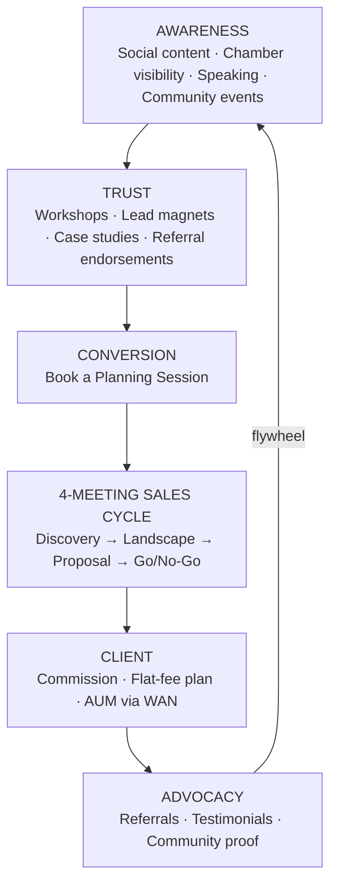
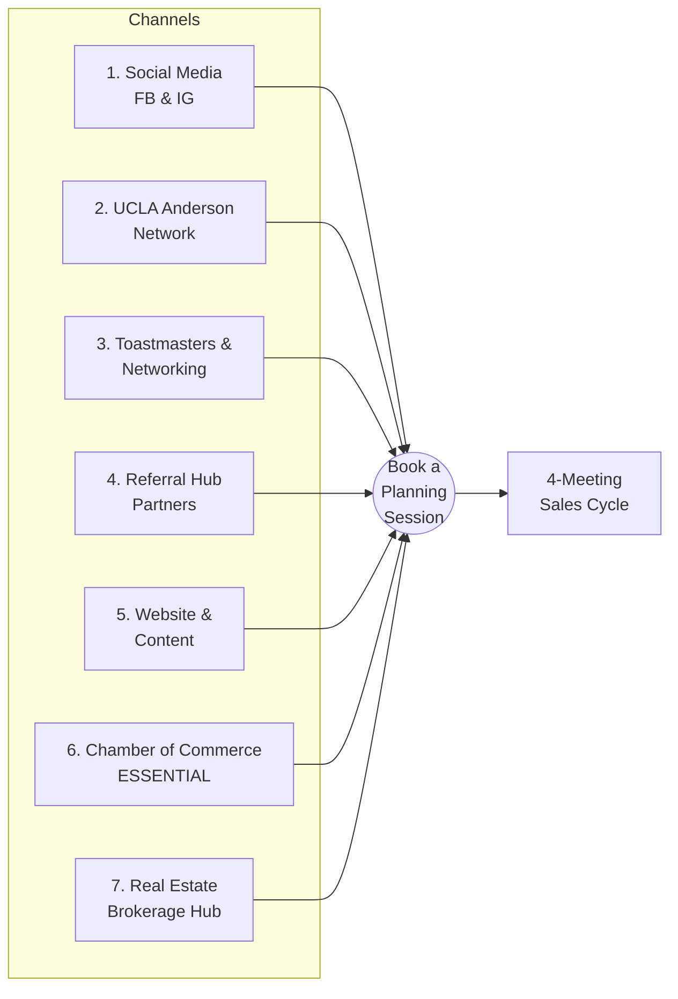
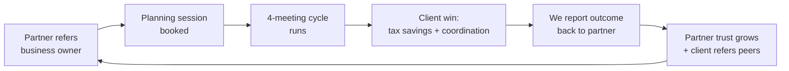
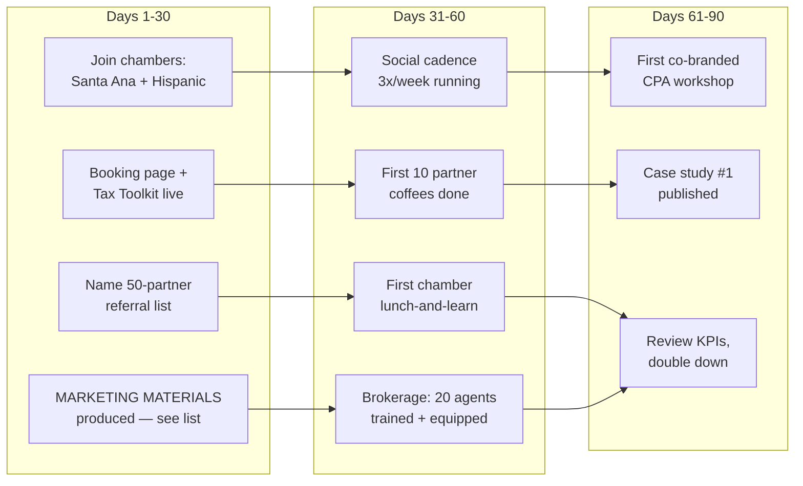

# Pinnacle Planning — Marketing Plan
**Make the right business owner feel seen — and create a natural path to a planning session.**
*Prepared: August 10, 2026 (rev. of Aug 2 plan) | Companion to WAN-Ops-2026-08-01 (Sales Operations Playbook) and the Client Presentation deck*

---

## 1. Executive Summary

Pinnacle Planning's marketing has one job: make the ideal business owner think **"these people help people like me"** — and then book a planning session. Everything in this plan funnels toward that single conversion event, because once a prospect enters the **4-meeting sales cycle**, the Sales Operations Playbook takes over.

**The strategy in one paragraph:** Lead with tax pain (the universal business-owner frustration), reinforce with the two hooks that speak to the heart — providing for the next generation and having one Wealth Architect who coordinates everything — earn trust through education and community presence (Chamber of Commerce is the essential channel), build referral hubs of CPAs, attorneys, bankers, and now real-estate brokerages who see the pain first, and cultivate the Hispanic business community as our emerging market. Every channel drives to one destination: a booked Discovery meeting.

**Top priorities:**
1. Chamber of Commerce presence — essential, immediate (Santa Ana Chamber + Hispanic Chamber)
2. Referral hub activation — CPAs first (they see the tax pain every April); real-estate brokerage hub added
3. Tax-pain content engine on Facebook & Instagram, backed by an expanded lead-magnet library
4. Hispanic emerging-market entry via Hispanic chambers and community associations
5. Website & lead magnets as the credibility anchor behind every channel
6. Sales-force marketing materials produced in Days 1–30 — no advisor walks into a business empty-handed

---

## 2. Positioning & Core Message

### Who we are (positioning statement)
> For business owners with $500K+ in revenue who are paying too much tax and flying blind despite making good money, Pinnacle Planning is the advanced planning division that quarterbacks your entire financial team — CPA, attorney, insurance, retirement — under a coordinated, fiduciary-minded plan. Unlike product-first agents or file-and-forget CPAs, we look at the whole picture, and we prove it in four structured meetings.

### Primary Hook #1: Taxes
> **"You built something. You're paying a significant tax bill every April. There are legal strategies most business owners never hear about that could shelter $100K to $300K of your income this year and turn your tax burden into your retirement plan. That conversation starts here."**

### Primary Hook #2: Provide for the Next Generation
> **"You sacrificed to build this. Now make it last. Your children shouldn't have to start from zero — there's a menu of options that can put them ahead of the crowd: college funding done right, a first-home head start, a business or wealth transfer that doesn't get eaten by taxes. Let's build their head start together."**

- **The idea:** parents who built a business want more than retirement — they want their children to *get ahead of the crowd*, and they want a **menu of concrete options** (529 and 529-alternatives, cash-value life insurance for a child, custodial strategies, trust structures, business succession) so they can choose deliberately instead of hoping.
- **Emotional connection:** *You built it — now make it last.* Family. Sacrifice. The years of long hours were never just for you; this is where they pay off for the people you did it for.
- **Where it leads:** the "Roadmap to Provide for the Next Generation" lead magnet (Section 6) and the college-funding comparison conversation in the planning session.

### Secondary Hook: The Wealth Architect
> **"You have partners in your business. But who's on your team for your wealth? Every entrepreneur and high-producing professional needs strong, proactive expertise in taxes, investments, estate planning, and real estate — and, most importantly, a Wealth Architect who puts it all together into one cohesive, holistic plan where every expert is coordinated, in the right role, working in your best interest."**

- **The idea:** high producers usually *have* advisors — a CPA here, a broker there — but no one is the architect. Each expert optimizes their own corner; nobody owns the blueprint. Pinnacle is the Wealth Architect: we design the plan, coordinate the specialists (taxes · investments · estate planning · real estate · insurance), and keep every role aligned to the owner's goals. (This is the Quarterback Model, told from the client's seat.)
- **Emotional connection:** *Free up time — more time for family.* A **sounding board** — relief from the quiet stress of having no one to talk business decisions through with. **Clarity** — one plan, one point of contact, goals kept aligned so you always know where you stand.
- **Where it leads:** the Asset Map lead magnet (Section 6) — the visual proof that someone finally sees the whole picture.

### Secondary messaging (after a hook opens the door)
Insurance gaps · no coordinated plan · wealth trapped in the business · no succession strategy · no trusted advisor · flying blind despite making good money · children's college and financial legacy.

**Added benefits woven into every secondary conversation:**
- **Mechanisms to save on business taxes** — entity-level strategies (Partnership, LLC, S-Corp, C-Corp), qualified plans (DBP/DCP), timing and compensation design — not just filing better, *structuring* better.
- **Help reduce operational burdens** — a coordinated advisory team takes recurring financial administration, plan maintenance, and vendor-wrangling off the owner's desk, returning hours to the business (or the family).

**Message discipline:** a hook gets them in the door — taxes for the head, next-generation for the heart, Wealth Architect for the overwhelmed; the full planning experience (Quarterback Model, Wealth Navigator, Right Capital) keeps them. Every asset uses exactly one hook — never stack all three in one piece.

---

## 3. Target Markets

### Core market
Business owners and entrepreneurs: **$500K+ business revenue, $250K–$1M+ personal income, age 40–60**, 1–10 employees, coachable, time-poor, no advisor they fully trust. (Full profile in the Sales Ops Playbook qualification filter.)

### Emerging market: the Hispanic business community
One of the fastest-growing segments of U.S. business ownership and broadly underserved by advanced planning. Values alignment is strong — family, legacy, multi-generational wealth. Entry channels: **Santa Ana Chamber of Commerce and the Hispanic Chamber of Commerce**, community business associations, Spanish-language business events. Same tax-pain hook, delivered with cultural fluency; bilingual materials developed over time. (Detailed plan in Section 8.)

### Market definition & identification

| Market | Definition | Approach |
|---|---|---|
| Core: established owners | $500K+ revenue, $250K–$1M+ personal income, age 40–60, 1–10 employees | Chambers, referral hubs, workshops, social content — book a planning session |
| Emerging: Hispanic business community | Same financial profile; family/legacy values emphasis; often first-generation wealth | Santa Ana Chamber + Hispanic Chamber, community connectors, bilingual education (Section 8) |
| Professional practices | PI lawyers, orthodontists, dentists, eye doctors (incl. pediatric) — high-income practice owners already in the network | Drop-off package + existing-relationship introductions (Section 9 marketing materials) |
| **How we identify them** | **Target IRS entity types: Partnership and S-Corp — ownership is most likely a single owner or a husband-and-wife team**, which matches our planning sweet spot (pass-through taxation, compensation design, family involvement) | **Research: California government/state business registries (CA Secretary of State business search, state license boards), LinkedIn, and local business publications and directories — combined with old-fashioned door-knocking on visibly successful local businesses** |

**Why entity type matters:** Partnerships and S-Corps are where the tax hook bites hardest — pass-through income lands on the owner's personal return, so the pain is *felt* personally every April, and husband-and-wife ownership means the family and next-generation hooks land in the same conversation.

---

## 4. The Marketing Funnel

Every channel feeds one funnel, and the funnel ends where the Sales Ops Playbook begins.

**Design principles:**
- Every asset has exactly one call to action: **book a planning session.**
- No channel is expected to close business — channels create warm, qualified conversations; the 4-meeting cycle closes.
- A well-closed "no-go" stays in the flywheel (6-month check-ins, referral potential).

---

## 5. Channel Strategy — Seven Channels, One Destination

### Channel 6 — Chamber of Commerce (ESSENTIAL — lead channel)
This is where the ideal client already congregates, and where referral partners (CPAs, attorneys, bankers) are also members.

| Element | Plan |
|---|---|
| Presence | Join the **Santa Ana Chamber** and the **Hispanic Chamber**; attend every mixer and expo for the first 90 days |
| Authority | Secure a committee or ambassador role within 6 months; target a board-adjacent role in year 2 |
| Education | Quarterly "Business Owner Tax Strategy" lunch-and-learn; offer as free chamber member benefit |
| Sponsorship | Sponsor 2–3 flagship events per year (visibility in front of qualified owners) |
| Conversion | Every talk and table ends with the same CTA: book a planning session; bring the Tax Essentials Toolkit as the takeaway |
| KPI | 4+ chamber-sourced planning sessions per quarter by Q2 2027 |

### Channel 4 — Referral Hub Partners (highest lead quality)
CPAs first — they see tax pain every April and can't solve it with filing.

- Build a named list of 20 CPAs, 10 estate attorneys, 5 commercial bankers, 10 bookkeepers, 5 non-competing insurance agents
- Value-first cadence: quarterly coffee/lunch, share the 2026 tax-limits reference card, co-branded workshop invitations
- Position as their "advanced planning department": we make *them* look good, we never touch their core service
- Formalize a two-way referral loop — we refer bookkeeping, tax filing, and legal work back
- KPI: 15 active referring partners and 2+ referred planning sessions per month within 12 months

### Channel 7 — Referral Hub: Real Estate Brokerage (NEW)
A partnered brokerage with **20 active agents** — every agent is a scout, and every property transaction is a financial-planning trigger moment.

- **Why it works:** clients buying (or selling) property are already reorganizing their finances — down payments, cash flow, entity questions, insurance, estate titling. It is the single most natural moment for **financial preparation**, and the agent is standing right there when it happens.
- **The agent's give:** a **complimentary planning session** the agent can offer every buying/selling client as a value-add — it makes the agent look good and costs them nothing. The session delivers:
  - a **professional report of the client's financial portfolio** (their full picture, organized — most have never seen it in one place)
  - **gaps / blind spots** — uncovered risks: protection shortfalls, titling problems, tax exposure, missing estate documents
  - **potential solutions** — a clear, no-pressure menu of next steps
- **Activation plan:** train the 20 agents in one lunch session (what to say, who fits, how to hand off); give each a co-branded one-pager; make booking effortless (dedicated link/QR per agent so referrals are tracked and credited).
- **Reciprocity:** we refer buyers, sellers, and 1031/investment-property conversations back to the brokerage — a genuine two-way loop.
- KPI: 20 agents trained in the first 60 days; 2+ brokerage-referred sessions per month by month 6.

### Channel 1 — Social Media (Facebook & Instagram)
- 3 posts/week: 2 pain-first educational (tax savings, flying blind, succession risk), 1 trust/community (chamber events, client outcomes, team)
- Monthly short-video series: "Strategies your CPA never showed you" (60–90 seconds, one strategy each)
- Modest paid boost on the best-performing tax-pain posts, geo-targeted to local business owners
- All links → planning session booking page
- KPI: cost per booked session, not likes

### Channel 2 — UCLA Anderson Network
- Matthew's relationship pipeline: quarterly value-first touches, guest-speaking offers, alumni panel participation
- Treat as a referral-partner and center-of-influence channel, not a volume channel
- KPI: 1 speaking engagement per quarter, 3+ high-quality introductions per quarter

### Channel 3 — Toastmasters & Professional Networking
- Elevator pitch optimized for curiosity: one strong statement, then let them ask
- Purpose: reps for the speaking-based authority strategy that Chamber and workshops depend on
- KPI: pipeline conversations opened per month

### Channel 5 — Website & Content (credibility anchor)
- Pinnacle Planning page aligned with the Client Presentation deck (Quarterback Model, Wealth Navigator, 4-meeting process, trust stats)
- Case studies in pain → strategy → net benefit format
- Full lead-magnet library (Section 6) with the **Tax Essentials Toolkit** as primary
- Prominent, friction-free booking flow (one click from every page)
- KPI: visit → booking conversion rate

---

## 6. Content Engine & Lead Magnets

### The lead-magnet library

Each magnet is a short, professional PDF (2–6 pages) gated behind an email + one qualifying question, and each maps to a hook and a sales conversation:

| Lead magnet | Hook it serves | Planning conversation it opens |
|---|---|---|
| **Tax Essentials Toolkit** (primary) | Taxes | The Discovery meeting itself |
| **Business Tax Strategy Guide** — by entity: Partnership, LLC, S-Corp, C-Corp | Taxes | Entity structure, compensation design, pass-through planning |
| **Retirement Income Blueprint** | Taxes / Architect | Turning the tax burden into the retirement plan |
| **Retirement Program Comparison** — 401(k), SEP-IRA, IRA, Defined Benefit Plan (DBP), Defined Contribution Plan (DCP) | Taxes / Architect | Which qualified plan fits the business; DBP for high-income owners |
| **Premium Financing Primer** | Architect | Advanced life-insurance funding for high-net-worth owners |
| **Asset Map Sample** | Wealth Architect | "Here's what your whole picture looks like on one page" |
| **Trust Preparation Worksheet** | Next Generation | Estate readiness; what to bring to the attorney |
| **Roadmap to Provide for the Next Generation** | Next Generation | The menu of head-start options for their children |
| **College Funding Plans for Your Child** — 529 and alternatives compared | Next Generation | College funding as the gateway to legacy planning |
| **Business Owner Protection Checklist** | Secondary | Key-man, buy-sell, owner protection |

### Case studies & articles — each one feeds a lead magnet

Every case study/article follows **pain → strategy → net benefit** and ends with the CTA to download its paired magnet (second CTA: book a planning session):

| Case study / article | Paired lead magnet |
|---|---|
| Premium Financing in action (how a $X policy was funded without writing the check) | Premium Financing Primer |
| Defined Benefit Plan: the six-figure deduction most owners have never heard of | Retirement Program Comparison |
| Annuities & lifetime retirement income: a paycheck that never stops | Retirement Income Blueprint |
| Life insurance beyond the death benefit (tax-advantaged living uses) | Business Owner Protection Checklist |
| Helping your children get a head start: one family's plan | Roadmap to Provide for the Next Generation |

### Monthly themes (rotating quarterly)

| Month | Theme | Anchor content | Lead magnet CTA |
|---|---|---|---|
| 1 | Tax pain | "Shelter $100K–$300K legally" video + posts | Tax Essentials Toolkit / Business Tax Strategy Guide |
| 2 | Protection & retirement | Key-man horror story · DBP case study | Protection Checklist / Retirement Program Comparison |
| 3 | Legacy & next generation | Head-start family case study · 529 vs. alternatives | Next-Generation Roadmap / College Funding Plans |

Repeat with fresh examples; layer in seasonal spikes: **January (new year planning), March–April (tax season pain peak — double the tax content), September–October (year-end planning window: "there's still time to act before December 31").**

### Community events
Community events are a content channel of their own: chamber expos, sponsored local events, school and youth-sports sponsorships, and Hispanic community celebrations (Section 8). Every event produces content (photos, recap post, one insight learned) and every table carries lead magnets and the booking QR code. Target: **one community event per month**, with each event feeding the social calendar the following week.

Every piece follows the format: **pain first → one insight → one CTA (book a planning session).**

---

## 7. Referral Flywheel

The most-missed step is **reporting the outcome back to the referring partner** (within compliance/privacy bounds). It closes the loop, makes the partner the hero, and reliably produces the next referral. This applies equally to CPAs, attorneys, and the real-estate agents in Channel 7.

---

## 8. Emerging Market Plan: Hispanic Business Community

**Phase 1 (Months 1–3): Presence.** Join the **Santa Ana Chamber and the Hispanic Chamber**; attend consistently; listen and map the community's business mix and existing advisor relationships. Identify 2–3 community connectors.

**Phase 2 (Months 4–6): Education.** Deliver the first bilingual tax-strategy workshop with a community partner (Hispanic CPA or attorney preferred — co-presenting builds borrowed trust). Translate the Tax Essentials Toolkit and the one-page Pinnacle overview into Spanish.

**Phase 3 (Months 7–12): Compounding.** Sponsor one flagship community event; publish Spanish-language social content monthly; build 3–5 referring relationships with Hispanic-market CPAs, bookkeepers, and lenders. Referrals within tight-knit business communities compound quickly once trust is established — patience in phases 1–2 is the investment.

**Messaging emphasis:** protect the family, the business, and the next generation — taxes as the entry point, legacy as the resonant theme (the **Next Generation hook is at its strongest in this market**). Cultural fluency over translation alone.

**KPI:** first 5 Hispanic-market planning sessions by Q2 2027; 2 active community referral partners by year end.

---

## 9. Roadmap

### 90-Day Launch Sprint

**Days 1–30 are marketing-materials days.** Producing the sales-force materials below is an *essential* first-month deliverable — nothing else in this plan works if advisors show up to chambers, brokerages, and door-knocks empty-handed.

### Marketing materials (Days 1–30 deliverables — essential)

The sales force needs the following in hand before outreach begins:

| Material | Purpose / Notes |
|---|---|
| **Drop-off package for business owners** | The leave-behind for door-knocks and referral introductions. Anchored by a **tax-savings case study** (pain → strategy → net benefit), plus the one-page Pinnacle overview and booking QR |
| **Flyer brochure** | General-audience tri-fold; **printing arranged through Scott / Michael's parents** (in-network print resource — confirm specs and turnaround in week 1) |
| **"Other services" flyer — existing professional network** | For warm relationships already in the network: **PI lawyer, orthodontist, dentist, eye doctor, kids' eye doctor** — practice owners who are both prospects and referral sources. Message: high-income practice owners have the same tax pain |
| **Simplistic / succinct flyers for non-professional business owners (Mom & Pop)** | Plain-language, single-page, minimal jargon — **built around Eddie's avatar** (the archetypal local owner). Three messages only: **(1) Business tax savings · (2) Owner protection · (3) Generational wealth transfer.** One CTA: the complimentary planning session |

Design rule for all materials: consistent Pinnacle branding, one hook per piece, one CTA per piece, bilingual versions to follow in the Hispanic-market phase (Section 8).

### 12-Month Milestones

| Quarter | Milestones |
|---|---|
| Q3 2026 (launch) | Chambers joined (Santa Ana + Hispanic); booking flow + Tax Toolkit live; **all Days 1–30 marketing materials produced**; social engine running; 10 partner meetings |
| Q4 2026 | Year-end planning push; first co-branded workshop; chamber committee role; 5 active referral partners; brokerage hub live (20 agents trained) |
| Q1 2027 | Tax-season content surge; bilingual toolkit live; first Hispanic-market workshop; case studies ×3; lead-magnet library complete |
| Q2 2027 | Chamber-sourced sessions at 4+/quarter; 10+ active partners; first Hispanic-market clients; brokerage referrals at 2+/month; review and reallocate budget to top 2 channels |

---

## 10. KPIs & Measurement

**North-star metric: planning sessions booked per month.**

| Level | Metric | Target (by Q2 2027) |
|---|---|---|
| Funnel top | Chamber/community interactions per month | 20+ |
| Funnel top | Social reach into local business-owner audience | trend up; CPL tracked |
| Funnel mid | Lead magnet downloads per month | 25+ |
| Funnel mid | Active referral partners (referred in last 6 months) | 15 |
| Funnel mid | Real-estate agents actively referring (last 90 days) | 8 of 20 |
| **Conversion** | **Planning sessions booked per month** | **8–10** |
| Sales handoff | Session → Meeting 2 progression rate | 70%+ |
| Business | New clients per quarter (Go decisions) | 6+ |
| Business | Revenue mix (commission / flat-fee / AUM) | tracked quarterly |

Review monthly; reallocate quarterly. Kill or fix any channel that produces zero booked sessions in two consecutive quarters (exception: Hispanic emerging market, which is on a 12-month trust-building horizon).

---

## 11. Budget Guidance (tiered)

| Tier | Annual range | Allocation |
|---|---|---|
| Lean | $10K–$20K | Chamber dues + events 35% · lead magnets/website 25% · print materials 10% · social boosts 15% · workshop costs 15% |
| Standard | $20K–$40K | Adds event sponsorships, bilingual material production, video production, brokerage co-branded materials |
| Growth | $40K+ | Adds paid social at scale, premium chamber sponsorships, dedicated Hispanic-market campaigns |

Time is the bigger budget: plan on **6–8 founder-hours per week** for chamber, networking, and partner meetings — this plan is relationship-led by design.

---

## 12. Execution

This plan only creates value once it is **signed off, adopted, and reviewed on a rhythm.** The operating cadence:

1. **Sign-off.** The team formally approves this Marketing Plan and **adopts the Roadmap (Section 9)** as the working schedule — including the Days 1–30 marketing-materials deliverables.
2. **Weekly KPI meeting.** A standing weekly meeting reviews the KPIs in **Section 10** — sessions booked, magnet downloads, partner activity, channel performance — and assigns the week's marketing actions. Short, standing agenda; same day/time every week.
3. **Progress tracker (separate document).** Develop and maintain a **separate tracking document** that scores actual results against this plan — each roadmap milestone, each KPI, each channel — updated before every weekly meeting so the meeting reviews facts, not memories.
4. **Monthly revision.** Revise the marketing plan **monthly as needed, by team agreement** — channels that outperform get budget and hours; channels that stall get fixed or killed (per the Section 10 rule). Each revision is dated (this document's convention: `Marketing_Plan_YYYYMMDD`) so the plan's evolution stays auditable.

**Ownership:** every KPI line and every roadmap item gets one named owner at sign-off. If it has no owner, it isn't in the plan.

---

## 13. Alignment With Sales Operations

- Marketing's finish line = a **booked planning session**; the Sales Ops Playbook (WAN-Ops-2026-08-01) owns everything after.
- The **qualification filter** applies at booking: non-fit leads are referred to M&M Wealth Associates — protecting the Pinnacle brand's exclusivity.
- The **Client Presentation deck** is the bridge asset: it's the visual used in Meeting 1 and the leave-behind credibility piece for referral partners.
- Marketing claims must stay consistent with sales claims: the $100K–$300K shelter figure, the four-meeting promise, and the quarterback positioning are the same in every asset.

---

*Pinnacle Planning is a division of M&M Wealth Associates. Investment management and comprehensive financial planning are provided through Wealth Advisory Now, a registered investment advisor. Marketing materials are educational and are not tax or legal advice.*
